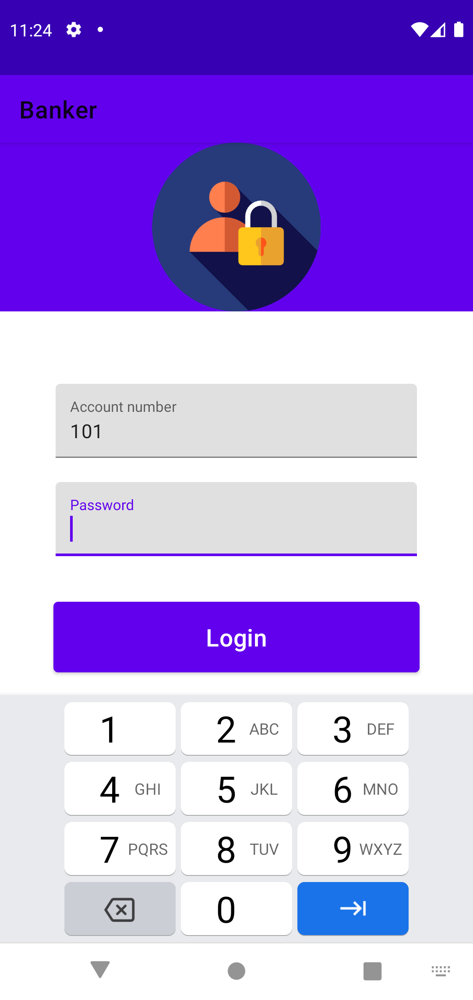
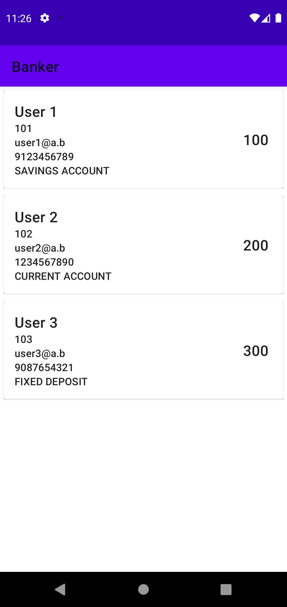
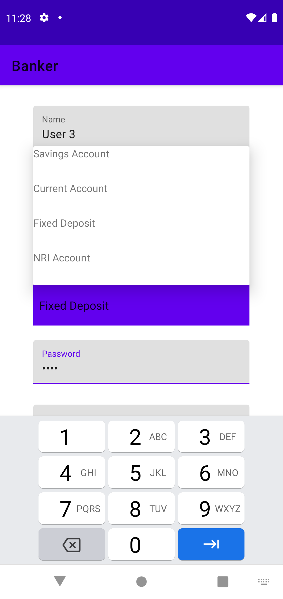
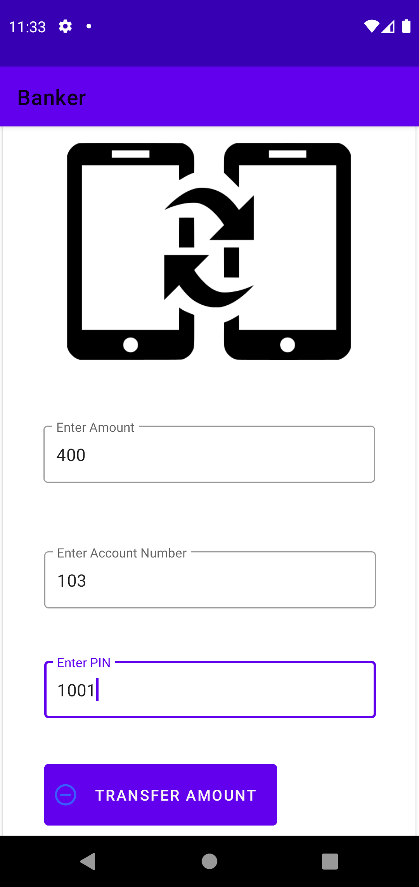
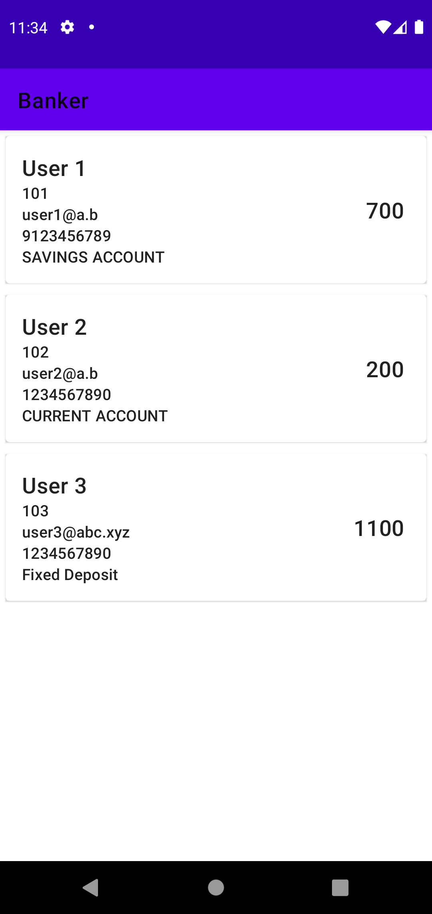

# Banker
## Exercise 8

An application following mvvm model and implementing room database,with CRUD operations.
 <table>

   <tr>
         <td></td>
         <td></td>
         <td></td>
         <td></td>
   </tr>
   <tr>
         <td></td>
         <td></td>
         <td></td>
         <td></td>
   </tr>
   <tr>
         <td></td>
         <td></td>
         <td></td>
         <td></td>
   </tr>
 </table>

In collabration,
[@Suraj Kumar](https://github.com/suraj27499)
[@Samuel Rajasingh](https://github.com/samuelrajasingh)
